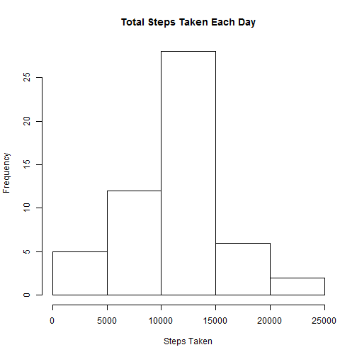
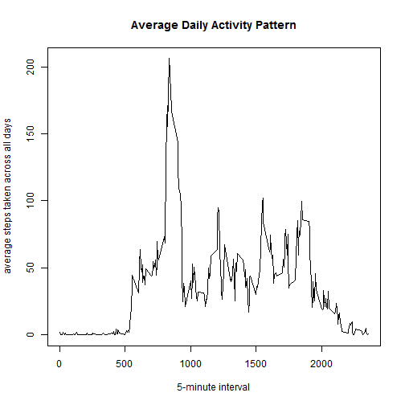
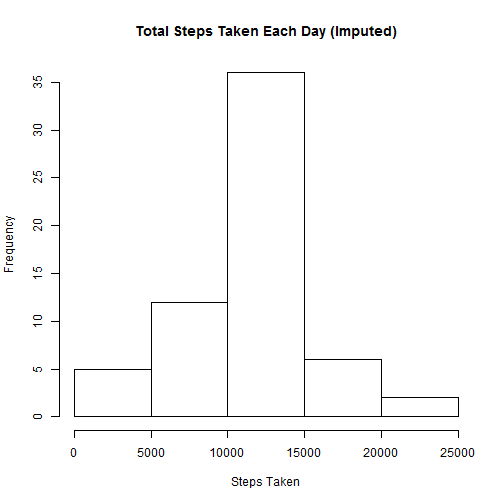

It is now possible to collect a large amount of data about personal movement using activity monitoring devices such as a Fitbit, Nike Fuelband, or Jawbone Up. These type of devices are part of the "quantified self" movement - a group of enthusiasts who take measurements about themselves regularly to improve their health, to find patterns in their behavior, or because they are tech geeks. But these data remain under-utilized both because the raw data are hard to obtain and there is a lack of statistical methods and software for processing and interpreting the data.

This assignment makes use of data from a personal activity monitoring device. This device collects data at 5 minute intervals through out the day. The data consists of two months of data from an anonymous individual collected during the months of October and November, 2012 and include the number of steps taken in 5 minute intervals each day.

The variables included in this dataset are:

* **steps**: Number of steps taking in a 5-minute interval (missing values are coded as NA)

* **date**: The date on which the measurement was taken in YYYY-MM-DD format

* **interval**: Identifier for the 5-minute interval in which measurement was taken

The dataset is stored in a comma-separated-value (CSV) file and there are a total of 17,568 observations in this dataset.

## Loading and preprocessing the data
1. Load the data from the csv file found within the zipped file.

```r
activity <- read.csv(unz("activity.zip", "activity.csv"), header = T, na.strings = "NA")
```
2. Convert the date column from a factor to a date

```r
activity$date <- as.Date(activity$date)
```


## What is mean total number of steps taken per day?
For this part, ignoring the missing values in the dataset.

1. Make a histogram of the total number of steps taken each day

```r
#First aggregate the sum of steps over each unique day
totStepsPerDay <- aggregate(activity[,c("steps")], by=list(activity$date), "sum")
names(totStepsPerDay) <- c("date", "totSteps")

#Then making a histogram of the total number of steps taken each day is trivial:
hist(totStepsPerDay$totSteps, main="Total Steps Taken Each Day", xlab="Steps Taken")
```

 

2. Calculate and report the mean and median total number of steps taken per day

```r
mean(totStepsPerDay$totSteps, na.rm=TRUE)
```

```
## [1] 10766.19
```

```r
median(totStepsPerDay$totSteps, na.rm=TRUE)
```

```
## [1] 10765
```

## What is the average daily activity pattern?
1. Make a time series plot (i.e. type = "l") of the 5-minute interval (x-axis) and the average number of steps taken, averaged across all days (y-axis)


```r
#aggregate the mean of steps over the interval, including all days
meanStepsPerInt <- aggregate(activity[,c("steps")], by=list(activity$interval), FUN="mean", na.rm=TRUE, na.action=NULL)
names(meanStepsPerInt) <- c("interval", "meanSteps")

#then plot the result
plot(main="Average Daily Activity Pattern",
     meanStepsPerInt$interval, meanStepsPerInt$meanSteps, 
     xlab="5-minute interval", ylab="average steps taken across all days",
     type="l")
```

 

2. Which 5-minute interval, on average across all the days in the dataset, contains the maximum number of steps?

```r
maxMeanStepsPerInt <- max(meanStepsPerInt$meanSteps)
rowsThatEqualMax <- meanStepsPerInt$meanSteps == maxMeanStepsPerInt
intWithMaxMeanSteps <- meanStepsPerInt$interval[rowsThatEqualMax]
intWithMaxMeanSteps
```

```
## [1] 835
```

## Imputing missing values
Note that there are a number of days/intervals where there are missing values (coded as NA). The presence of missing days may introduce bias into some calculations or summaries of the data.

1. Calculate and report the total number of missing values in the dataset (i.e. the total number of rows with NAs)

```r
rowsWithNAs <- is.na(activity$steps)
sum(rowsWithNAs)
```

```
## [1] 2304
```
2. Devise a strategy for filling in all of the missing values in the dataset. The strategy does not need to be sophisticated. For example, you could use the mean/median for that day, or the mean for that 5-minute interval, etc.

**Chosen strategy: replace each NA value with the mean for its interval**

3. Create a new dataset that is equal to the original dataset but with the missing data filled in.

```r
#Copy original data
impActivity <- activity
#Identify the target rows (containing NA values)
targetRows <- which(rowsWithNAs)
#Replace each NA value by the mean for its interval
for(t in targetRows){
  rowOfTargetMean <- which(meanStepsPerInt$interval == impActivity$interval[t])
  impActivity$steps[t] <- meanStepsPerInt$meanSteps[rowOfTargetMean]
}
```

4. a) Make a histogram of the total number of steps taken each day and Calculate and report the mean and median total number of steps taken per day. 


```r
#borrowing from earlier code, but using impActivty instead, we have that:
totStepsPerDay <- aggregate(impActivity[,c("steps")], by=list(impActivity$date), "sum")
names(totStepsPerDay) <- c("date", "totSteps")
hist(totStepsPerDay$totSteps, main="Total Steps Taken Each Day (Imputed)", xlab="Steps Taken")
```

 

```r
mean(totStepsPerDay$totSteps, na.rm=TRUE)
```

```
## [1] 10766.19
```

```r
median(totStepsPerDay$totSteps, na.rm=TRUE)
```

```
## [1] 10766.19
```

b) Do these values differ from the estimates from the first part of the assignment? 

**Yes!** 

c) What is the impact of imputing missing data on the estimates of the total daily number of steps?

**The data is more "centered" after imputing, as can bee seen by higher frequency of the 10000-15000 break and the median shifting to the mean.**

## Are there differences in activity patterns between weekdays and weekends?

1. Create a new factor variable in the dataset with two levels - "weekday" and "weekend" indicating whether a given date is a weekday or weekend day.

```r
weekendVals <- c("Saturday", "Sunday")
weekendRows <- weekdays(impActivity$date) %in% weekendVals
impActivity$dayType[weekendRows] <- "weekend"
impActivity$dayType[!weekendRows] <- "weekday"
```

2. Make a panel plot containing a time series plot (i.e. type = "l") of the 5-minute interval (x-axis) and the average number of steps taken, averaged across all weekday days or weekend days (y-axis). See the README file in the GitHub repository to see an example of what this plot should look like using simulated data.

```r
#aggregate the mean of steps over the interval and dayType
impMeanStepsPerInt <- aggregate(impActivity[,c("steps")], by=list(impActivity$interval, impActivity$dayType), FUN="mean", na.rm=TRUE, na.action=NULL)
names(impMeanStepsPerInt) <- c("interval", "dayType","meanSteps")

#make the plot using lattice
library(lattice)
xyplot(meanSteps ~ interval|dayType, 
           data = impMeanStepsPerInt,
           type = "l",
           xlab = "Interval",
           ylab = "Number of steps",
           layout=c(1,2))
```

 
